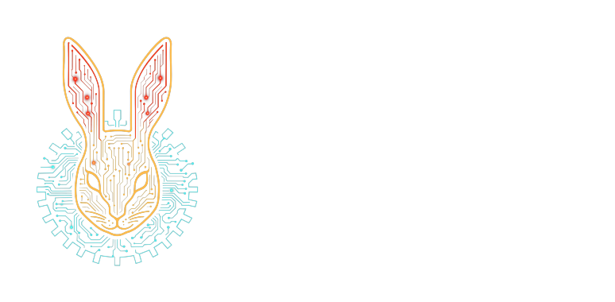

# kotlin-random-gen



<p align=center>
    
    
</p>

`kotlin-random-gen` is a Kotlin Multiplatform property-based data generation library built on
`kotlin-random`.

It provides a declarative `Gen<T>` DSL, deterministic tape replay, simple shrinking/minimization for
failing values, generated function values through `CoGen`, and low-level bit utilities used by the
replay engine.

## 🚀 Installation

```kotlin
repositories {
    mavenCentral()
}

dependencies {
    implementation("one.wabbit:kotlin-random-gen:2.0.0")
}
```

## 🚀 Usage

```kotlin
import one.wabbit.random.gen.Gen

val userId = Gen.int(1..10_000)
val username = Gen.string(3..12, Gen.printableAsciiChar)
val user = Gen.zip(userId, username).map { (id, name) -> id to name }

Gen.foreach(user, count = 100) { (id, name) ->
    check(id > 0)
    check(name.isNotEmpty())
}
```

## Sampling

```kotlin
import kotlin.random.Random
import one.wabbit.random.gen.Gen
import one.wabbit.random.gen.sample

val value = Gen.int(0..99).sample(Random(1234))

check(value != null && value in 0..99)
```

`sample` can return null when a generator rejects a value through `filter`. Use `sampleUnbounded`
when you want to retry until a value is produced.

## Replay and Minimization

The sampling interpreter reads bits from a `TapeSeed`. Failed property checks can be minimized and
reported with the minimized tape:

```kotlin
import kotlin.random.Random
import one.wabbit.random.gen.Gen
import one.wabbit.random.gen.foreachMin

Gen.int(0..100).foreachMin(
    random = Random(1),
    iters = 100,
) { value ->
    check(value < 50)
}
```

When minimization succeeds, `MinimizedException` carries the original exception, minimized value,
and replay tape.

## Status

This library is useful for internal property tests and deterministic generation workflows. The
high-level `Gen` APIs are the primary surface. Lower-level tape, codec, and bit-sequence utilities
are public support APIs but should be treated as advanced tools.

## Documentation

- [User guide](docs/user-guide.md)
- [API reference notes](docs/api-reference.md)
- [Troubleshooting](docs/troubleshooting.md)
- [Development](docs/development.md)

Generated API docs can be built locally with Dokka. See [API reference notes](docs/api-reference.md)
for the command.

## Release Notes

- [CHANGELOG.md](CHANGELOG.md)

## Licensing

This project is licensed under the GNU Affero General Public License v3.0 (AGPL-3.0) for open
source use.

For commercial use, contact Wabbit Consulting Corporation at `wabbit@wabbit.one`.

## Contributing

Before contributions can be merged, contributors need to agree to the repository CLA.
